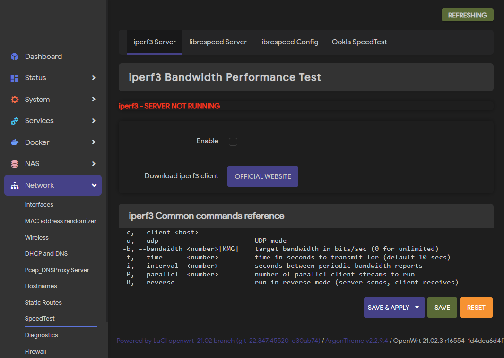
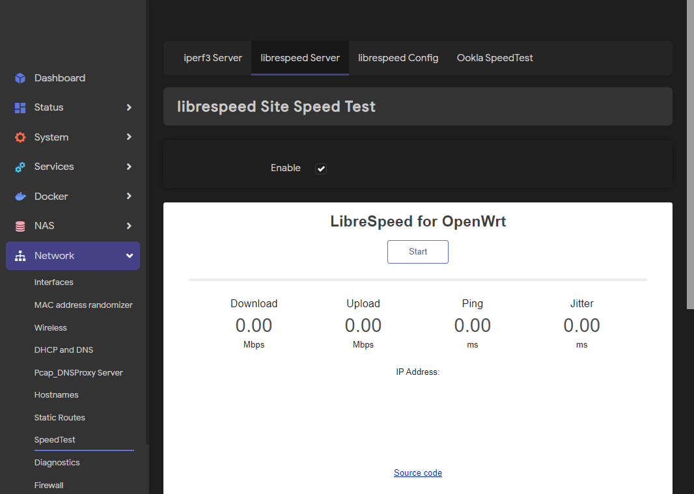
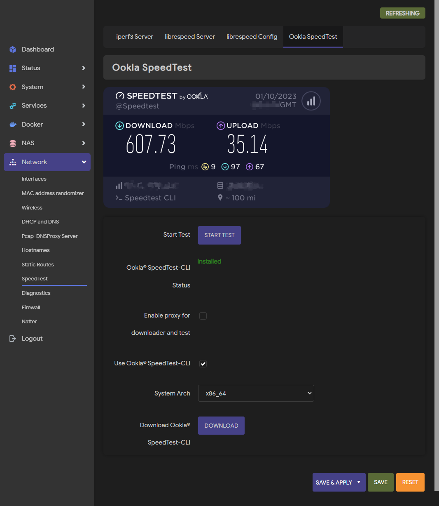

# LuCI Network Speed Test

### Screenshots

  
  
  
  

### How to install

#### Prerequisites

This package depends on python3-speedtest-cli which in turn depends on python3-base and various other python3 libraries. These packages combined can take up a lot of space on a router so before installing luci-app-netspeedtest, make sure you have enough space to install python3-speedtest-cli. You can check this by searching for python3-speedtest-cli under the software page in LuCI and try to install it, it will tell you how much space it and its dependencies require, just compare that to how much space you have left.

#### Installation

1. Goto ~~[releases](https://github.com/muink/luci-app-netspeedtest/tree/releases)~~ [here](https://fantastic-packages.github.io/packages/)
2. Download the latest version of ipk
3. Login router and goto **System --> Software**
4. Upload and install ipk
5. Reboot if the app is not automatically added in page
6. Goto **Network --> SpeedTest**

### Build

- Compile from OpenWrt/LEDE SDK

```
# Take the x86_64 platform as an example
tar xjf openwrt-sdk-21.02.3-x86-64_gcc-8.4.0_musl.Linux-x86_64.tar.xz
# Go to the SDK root dir
cd OpenWrt-sdk-*-x86_64_*
# First run to generate a .config file
make menuconfig
./scripts/feeds update -a
./scripts/feeds install -a
# Get Makefile
git clone --depth 1 --branch master --single-branch --no-checkout https://github.com/muink/luci-app-netspeedtest.git package/luci-app-netspeedtest
pushd package/luci-app-netspeedtest
umask 022
git checkout
popd
# Select the package LuCI -> Applications -> luci-app-netspeedtest
make menuconfig
# Start compiling
make package/luci-app-netspeedtest/compile V=99
```

### License

- This project is licensed under the MIT License
